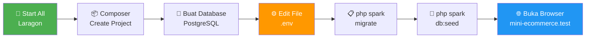
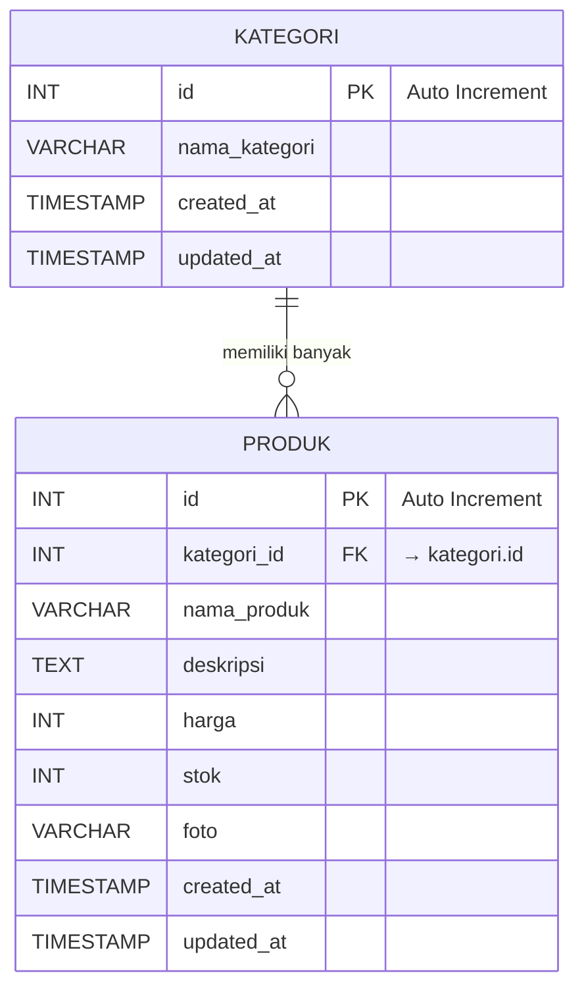
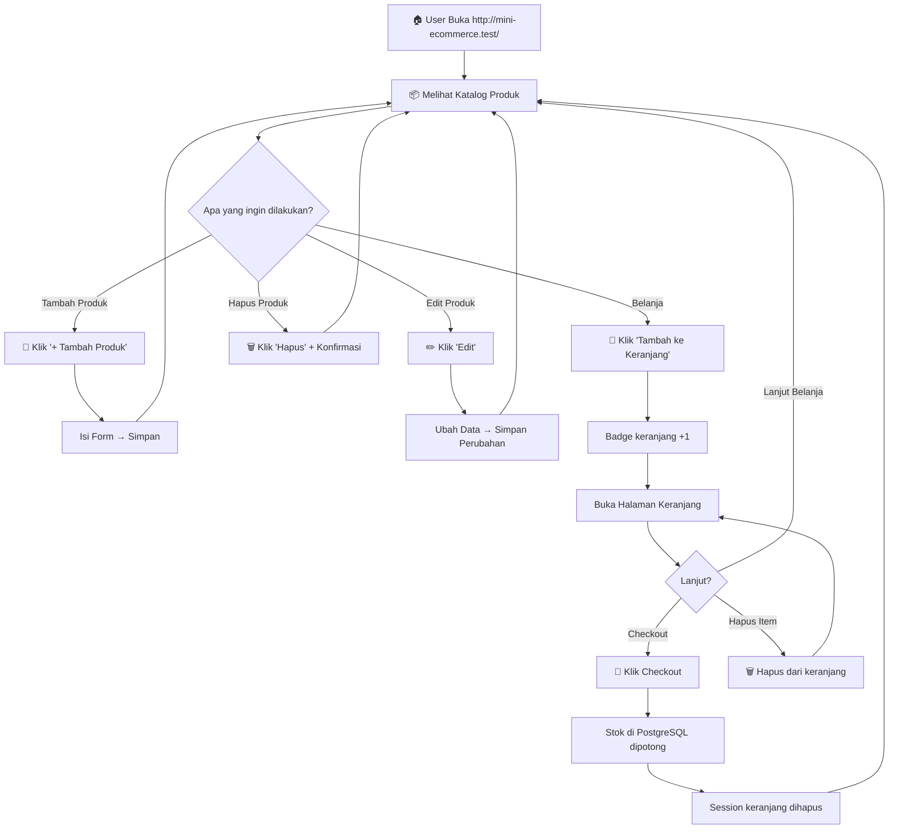

# 📋 Skrip Presentasi Project Mini E-Commerce

> **Tujuan**: Menjelaskan project "Mini E-Commerce" secara berurutan dan detail kepada pembimbing, mulai dari arsitektur backend/database hingga frontend dan tampilan di browser.

---

## 🎬 PEMBUKAAN

> *"Assalamualaikum / Selamat pagi/siang Pak/Bu. Perkenalkan, saya [NAMA] akan mempresentasikan project Mini E-Commerce yang telah saya bangun. Project ini adalah sebuah web e-commerce sederhana namun fungsional, yang mampu mengelola produk, mengkategorikannya, menampilkan katalog, dan menyelesaikan proses belanja melalui keranjang serta checkout."*

> *"Saya akan menjelaskan secara berurutan, dimulai dari bagaimana project ini di-setup dari nol menggunakan Laragon, dilanjutkan teknologi yang digunakan, struktur database, backend logic, hingga tampilan frontend-nya."*

---

## 📌 BAGIAN 0: ALUR SETUP DARI NOL HINGGA MENJADI URL

> *"Sebelum masuk ke detail kode, saya akan menjelaskan dulu bagaimana alur membangun project ini dari awal sampai bisa diakses di browser. Ada 7 langkah utama."*

---

### LANGKAH 1 — Start All Laragon

> *"Langkah pertama, saya membuka aplikasi **Laragon** yang merupakan local development environment untuk Windows. Laragon ini menggabungkan web server (Apache), database server (PostgreSQL), dan PHP dalam satu paket."*

> *"Di Laragon, saya klik tombol **'Start All'** untuk menjalankan semua service sekaligus. Setelah tombol berubah hijau dan statusnya 'Started', artinya Apache dan PostgreSQL sudah aktif dan siap digunakan."*

```
┌──────────────────────────────────┐
│          🦁 LARAGON              │
│                                  │
│   Apache   ● Running (Port 80)   │
│   PostgreSQL ● Running (Port 5432)│
│                                  │
│       [ 🟢 Start All ]           │
└──────────────────────────────────┘
```

---

### LANGKAH 2 — Membuat Project CodeIgniter 4

> *"Selanjutnya, saya membuat project CodeIgniter 4 baru. Caranya bisa melalui **Terminal Laragon** (klik kanan icon Laragon → Terminal), lalu masuk ke folder `www` milik Laragon dan jalankan perintah Composer:"*

```bash
# Buka terminal Laragon, lalu jalankan:
composer create-project codeigniter4/appstarter mini-ecommerce
```

> *"Perintah ini akan mendownload framework CodeIgniter 4 beserta semua dependensinya ke folder `D:\laragon\www\mini-ecommerce\`. Karena folder project berada di dalam `www` milik Laragon, otomatis Laragon akan membuatkan **Virtual Host** dengan URL `http://mini-ecommerce.test/`."*

> *"Fitur auto virtual host inilah yang membuat Laragon sangat praktis — kita tidak perlu konfigurasi manual di file `hosts` atau Apache vhost."*

---

### LANGKAH 3 — Membuat Database di PostgreSQL

> *"Sebelum project bisa menyimpan data, kita perlu membuat database di PostgreSQL terlebih dahulu. Ini bisa dilakukan lewat **pgAdmin** atau langsung via terminal."*

**Cara via Terminal Laragon:**
```bash
# Akses PostgreSQL CLI
psql -U postgres

# Buat database baru
CREATE DATABASE mini_ecommerce;

# Verifikasi database sudah ada
\l

# Keluar dari psql
\q
```

**Cara via pgAdmin:**
> *"Atau bisa juga lewat pgAdmin 4 — klik kanan pada 'Databases' → 'Create' → 'Database', lalu isi nama `mini_ecommerce` dan klik Save."*

---

### LANGKAH 4 — Konfigurasi File `.env`

> *"Langkah paling krusial adalah mengkonfigurasi file `.env`. File ini berisi pengaturan environment project yang bersifat rahasia/lokal dan **tidak boleh di-upload ke Git**."*

> *"Di root folder project, sudah ada file bernama `env` (tanpa titik). Pertama, kita rename menjadi `.env`, lalu edit isinya."*

**File**: [.env](file:///d:/laragon/www/mini-ecommerce/.env)

> *"Ada 3 bagian utama yang perlu diubah:"*

**🔹 1. Aktifkan Mode Development:**
```env
# Ubah dari 'production' ke 'development' agar error tampil detail saat coding
CI_ENVIRONMENT = development
```
> *"Mode development penting saat tahap pengembangan agar pesan error tampil detail di browser, sehingga debugging lebih mudah. Nanti saat deploy ke server produksi, ini harus dikembalikan ke `production`."*

**🔹 2. Set Base URL sesuai Virtual Host Laragon:**
```env
app.baseURL = 'http://mini-ecommerce.test/'
```
> *"Base URL ini harus sesuai dengan nama folder project kita di Laragon. Karena folder-nya `mini-ecommerce`, maka URL-nya jadi `mini-ecommerce.test`."*

**🔹 3. Konfigurasi Koneksi Database PostgreSQL:**
```env
database.default.hostname = localhost
database.default.database = mini_ecommerce
database.default.username = postgres
database.default.password = 
database.default.DBDriver = Postgre
database.default.port = 5432
database.default.charset = utf8
database.default.DBCollat =
```

> *"Penjelasan tiap baris:"*

| Baris | Penjelasan |
|---|---|
| `hostname = localhost` | Database ada di komputer lokal kita |
| `database = mini_ecommerce` | Nama database yang sudah kita buat di langkah 3 |
| `username = postgres` | Username default PostgreSQL |
| `password = ` | Kosong karena instalasi lokal tanpa password |
| `DBDriver = Postgre` | Driver CI4 untuk PostgreSQL (bukan `MySQLi`) |
| `port = 5432` | Port default PostgreSQL |
| `charset = utf8` | Encoding karakter UTF-8 |

> *"Perhatikan bahwa `DBDriver` diisi `Postgre` (tanpa 'SQL'). Ini adalah nama driver resmi CodeIgniter 4 untuk PostgreSQL. Kalau salah tulis, koneksi database akan gagal."*

---

### LANGKAH 5 — Membuat Tabel via Migration (Terminal)

> *"Setelah koneksi database terkonfigurasi, selanjutnya kita membuat tabel-tabel yang diperlukan. Di CI4, ini dilakukan menggunakan fitur **Migration** lewat terminal."*

**Membuat file migration:**
```bash
# Buka terminal di folder project, lalu jalankan:
php spark make:migration CreateKategoriTable
php spark make:migration CreateProdukTable
```
> *"Perintah ini akan membuat file migration kosong di folder `app/Database/Migrations/`. Lalu kita isi struktur tabelnya di dalam file tersebut (seperti yang sudah saya jelaskan di Bagian 2 nanti)."*

**Menjalankan migration:**
```bash
# Eksekusi semua migration — tabel akan terbuat di PostgreSQL
php spark migrate
```

> *"Saat perintah ini dijalankan, CI4 membaca semua file di folder Migrations dan mengeksekusi method `up()` di dalamnya. Hasilnya, tabel `kategori` dan `produk` terbentuk di database `mini_ecommerce` PostgreSQL."*

```
┌─────────────────────────────────────────┐
│  Terminal Output:                       │
│                                         │
│  > php spark migrate                    │
│  Running all new migrations...          │
│  ✔ CreateKategoriTable    (done)        │
│  ✔ CreateProdukTable      (done)        │
└─────────────────────────────────────────┘
```

---

### LANGKAH 6 — Mengisi Data Awal via Seeder (Terminal)

> *"Setelah tabel terbentuk, kita perlu mengisinya dengan data contoh menggunakan **Seeder**."*

**Membuat file seeder:**
```bash
php spark make:seeder ShopSeeder
```

**Menjalankan seeder:**
```bash
# Eksekusi seeder — data kategori dan produk masuk ke PostgreSQL
php spark db:seed ShopSeeder
```

> *"Seeder ini mengisi 3 kategori dan 3 produk sekaligus ke database. Jadi saat kita buka halaman utama, sudah langsung ada data yang bisa ditampilkan."*

---

### LANGKAH 7 — Akses Project di Browser 🎉

> *"Setelah semua langkah di atas selesai, project sudah siap diakses. Buka browser dan ketik:"*

```
http://mini-ecommerce.test/
```

> *"Dan... halaman katalog produk langsung tampil dengan 3 produk yang sudah kita seed tadi! Project sudah berjalan penuh."*

### Ringkasan Alur Setup:



---

## 📌 BAGIAN 1: TEKNOLOGI & ARSITEKTUR YANG DIGUNAKAN

> *"Project ini dibangun menggunakan **framework CodeIgniter 4 (CI4)** dengan bahasa PHP sebagai backend, dan menggunakan database **PostgreSQL** sebagai penyimpanan datanya. Untuk frontend, saya menggunakan **Bootstrap 5** sebagai CSS framework agar tampilan lebih rapi dan responsif."*

> *"CodeIgniter 4 menggunakan arsitektur **MVC** atau **Model-View-Controller**, yang artinya kode saya terpisah menjadi 3 lapisan utama:"*
> - **Model** → Bertugas berkomunikasi langsung dengan database (query, insert, update, delete)
> - **View** → Bertugas menampilkan halaman HTML ke user
> - **Controller** → Bertugas menjadi penghubung antara Model dan View; berisi logika bisnis

> *"Saya juga menggunakan **Laragon** sebagai local development server, sehingga project bisa diakses lewat URL `http://mini-ecommerce.test/` di browser lokal saya."*

### File referensi:
| Komponen | File |
|---|---|
| Konfigurasi environment | [.env](file:///d:/laragon/www/mini-ecommerce/.env) |
| Konfigurasi database | [Database.php](file:///d:/laragon/www/mini-ecommerce/app/Config/Database.php) |
| Routing | [Routes.php](file:///d:/laragon/www/mini-ecommerce/app/Config/Routes.php) |

---

## 📌 BAGIAN 2: DATABASE — STRUKTUR TABEL (MIGRATION)

> *"Sekarang kita masuk ke bagian database. Saya menggunakan **PostgreSQL** yang berjalan di port 5432 dengan nama database `mini_ecommerce`. Di CodeIgniter 4, pembuatan tabel dilakukan secara terstruktur melalui fitur yang namanya **Migration**."*

> *"Migration ini memungkinkan saya membuat dan memodifikasi tabel database menggunakan kode PHP, bukan query SQL manual. Keuntungannya adalah perubahan struktur database bisa dilacak, di-rollback, dan portable ke environment lain."*

### 2.1 — Tabel `kategori` (dibuat pertama)

> *"Tabel pertama yang saya buat adalah tabel **kategori**. File migration-nya ada di:*"
> [CreateKategoriTable.php](file:///d:/laragon/www/mini-ecommerce/app/Database/Migrations/2026-07-07-033040_CreateKategoriTable.php)

> *"Strukturnya sebagai berikut:"*

| Kolom | Tipe Data | Keterangan |
|---|---|---|
| `id` | INT(11) UNSIGNED | Primary Key, Auto Increment |
| `nama_kategori` | VARCHAR(100) | Nama kategori produk |
| `created_at` | TIMESTAMP | Waktu data dibuat (nullable) |
| `updated_at` | TIMESTAMP | Waktu data terakhir diupdate (nullable) |

> *"Tabel ini berfungsi menyimpan data kategori produk, misalnya 'Gadget & Audio', 'Computer Peripheral', dan 'Fragrance'. Kolom `id` menjadi primary key yang auto increment."*

---

### 2.2 — Tabel `produk` (dibuat kedua, berelasi ke kategori)

> *"Tabel kedua adalah tabel **produk**. File migration-nya ada di:*"
> [CreateProdukTable.php](file:///d:/laragon/www/mini-ecommerce/app/Database/Migrations/2026-07-07-033053_CreateProdukTable.php)

> *"Strukturnya sebagai berikut:"*

| Kolom | Tipe Data | Keterangan |
|---|---|---|
| `id` | INT(11) UNSIGNED | Primary Key, Auto Increment |
| `kategori_id` | INT(11) UNSIGNED | **Foreign Key** → ke tabel `kategori.id` |
| `nama_produk` | VARCHAR(255) | Nama produk |
| `deskripsi` | TEXT | Deskripsi lengkap produk (nullable) |
| `harga` | INT | Harga produk dalam Rupiah |
| `stok` | INT | Jumlah stok tersedia (default: 0) |
| `foto` | VARCHAR(255) | Nama file gambar produk (nullable) |
| `created_at` | TIMESTAMP | Waktu data dibuat |
| `updated_at` | TIMESTAMP | Waktu data terakhir diupdate |

> *"Yang penting di sini, kolom `kategori_id` memiliki **relasi foreign key** ke tabel `kategori` pada kolom `id`, dengan aturan **ON DELETE CASCADE** dan **ON UPDATE CASCADE**. Artinya, jika sebuah kategori dihapus, maka semua produk yang terkait dengan kategori itu akan otomatis ikut terhapus."*

### Diagram relasi tabel:



---

## 📌 BAGIAN 3: DATABASE — SEEDER (Data Awal)

> *"Setelah tabel terbentuk, saya juga menyiapkan **Seeder** untuk mengisi data awal ke database secara otomatis. File seeder-nya ada di:*"
> [ShopSeeder.php](file:///d:/laragon/www/mini-ecommerce/app/Database/Seeds/ShopSeeder.php)

> *"Seeder ini mengisi 3 data kategori dan 3 data produk sekaligus."*

### Data Kategori yang di-seed:
| ID | Nama Kategori |
|---|---|
| 1 | Gadget & Audio |
| 2 | Computer Peripheral |
| 3 | Fragrance |

### Data Produk yang di-seed:
| Nama Produk | Kategori | Harga | Stok |
|---|---|---|---|
| Kinera Celest Wyvern Abyss IEM | Gadget & Audio | Rp 450.000 | 15 |
| Aula S75 Pro Mechanical Keyboard | Computer Peripheral | Rp 650.000 | 8 |
| Afnan Supremacy Collector Edition EDP | Fragrance | Rp 850.000 | 5 |

> *"Untuk menjalankan migration dan seeder, saya cukup eksekusi perintah terminal berikut:"*
> ```bash
> php spark migrate        # Membuat semua tabel
> php spark db:seed ShopSeeder  # Mengisi data awal
> ```

---

## 📌 BAGIAN 4: BACKEND — MODEL (Komunikasi ke Database)

> *"Sekarang kita masuk ke lapisan backend, yaitu Model. Saya memiliki 2 Model."*

### 4.1 — KategoriModel

> *"Model ini ada di:*" [KategoriModel.php](file:///d:/laragon/www/mini-ecommerce/app/Models/KategoriModel.php)

> *"Model ini cukup sederhana. Tugasnya mengkoneksikan kode PHP ke tabel `kategori`. Properti penting yang saya set:"*
> - `$table = 'kategori'` → nama tabel yang dituju
> - `$primaryKey = 'id'` → kolom primary key
> - `$allowedFields = ['nama_kategori']` → kolom yang boleh diisi/diubah oleh pengguna
> - `$returnType = 'array'` → data yang dikembalikan berbentuk array PHP

> *"Model ini digunakan terutama saat form Tambah Produk dan Edit Produk, yaitu untuk mengambil daftar semua kategori dan menampilkannya di dropdown pilihan."*

---

### 4.2 — ProdukModel

> *"Model ini ada di:*" [ProdukModel.php](file:///d:/laragon/www/mini-ecommerce/app/Models/ProdukModel.php)

> *"Model ini lebih lengkap karena berinteraksi dengan tabel `produk` yang memiliki lebih banyak kolom. Properti penting:"*
> - `$allowedFields = ['kategori_id', 'nama_produk', 'deskripsi', 'harga', 'stok', 'foto']`

> *"Yang menarik, di model ini saya menambahkan sebuah **custom method** bernama `getProdukWithKategori()`:*"

```php
public function getProdukWithKategori()
{
    return $this->select('produk.*, kategori.nama_kategori')
                ->join('kategori', 'kategori.id = produk.kategori_id')
                ->findAll();
}
```

> *"Method ini melakukan **JOIN query** antara tabel `produk` dan tabel `kategori` berdasarkan `kategori_id`. Tujuannya agar ketika data produk ditampilkan di halaman utama, kita juga bisa langsung menampilkan **nama kategori** produk tersebut, bukan hanya angka ID-nya."*

---

## 📌 BAGIAN 5: BACKEND — CONTROLLER (Logika Bisnis Utama)

> *"Controller adalah otak dari project ini. Semua logika bisnis ada di sini. Saya hanya menggunakan 1 controller utama yaitu **Shop Controller**:*"
> [Shop.php](file:///d:/laragon/www/mini-ecommerce/app/Controllers/Shop.php)

> *"Controller ini memiliki **9 method/fungsi** utama. Saya akan jelaskan satu per satu berurutan sesuai alur pemakaian."*

---

### 5.1 — `index()` → Menampilkan Halaman Katalog Produk

```php
public function index()
{
    $produkModel = new ProdukModel();
    $data['daftar_produk'] = $produkModel->getProdukWithKategori();
    return view('shop_view', $data);
}
```

> *"Method ini dipanggil ketika user mengakses halaman utama (`/`). Ia memanggil `getProdukWithKategori()` dari ProdukModel untuk mengambil semua produk beserta nama kategorinya, lalu mengirim data tersebut ke view `shop_view`."*

---

### 5.2 — `tambah()` → Menampilkan Form Tambah Produk

```php
public function tambah()
{
    $kategoriModel = new KategoriModel();
    $data['daftar_kategori'] = $kategoriModel->findAll();
    return view('tambah_produk_view', $data);
}
```

> *"Saat user klik tombol '+ Tambah Produk', method ini dipanggil. Ia mengambil semua data kategori dari database menggunakan `findAll()`, lalu mengirimnya ke view form tambah produk. Data kategori ini akan digunakan untuk mengisi pilihan dropdown kategori di form."*

---

### 5.3 — `simpan()` → Menyimpan Produk Baru ke Database

> *"Method ini menerima data dari form yang dikirim via **HTTP POST**. Prosesnya:"*
> 1. Menangkap file foto yang diupload user menggunakan `$this->request->getFile('foto')`
> 2. Jika file valid dan belum dipindahkan → generate nama file acak unik dengan `getRandomName()`, lalu pindahkan ke folder `public/uploads/`
> 3. Jika user tidak upload foto, pakai nama default `default.png`
> 4. Menyimpan seluruh data produk (kategori_id, nama, deskripsi, harga, stok, foto) ke database via `$produkModel->save()`
> 5. Redirect kembali ke halaman utama

---

### 5.4 — `edit($id)` → Menampilkan Form Edit Produk

> *"Method ini menerima parameter `$id` dari URL. Ia mencari produk spesifik berdasarkan ID dan juga mengambil daftar kategori untuk dropdown. Data lama produk ditampilkan di form agar user bisa melihat dan mengubah yang diperlukan."*

---

### 5.5 — `update($id)` → Menyimpan Perubahan Produk ke Database

> *"Logikanya mirip dengan `simpan()`, tapi ada tambahan pengecekan:"*
> 1. Jika user upload foto baru → foto lama dihapus dari server (agar tidak jadi sampah file) menggunakan `unlink()`
> 2. Jika user **tidak** upload foto baru → tetap pakai foto lama
> 3. Data diupdate menggunakan `$produkModel->update($id, [...])`

---

### 5.6 — `delete($id)` → Menghapus Produk

```php
public function delete($id)
{
    $produkModel = new ProdukModel();
    $produkModel->delete($id);
    return redirect()->to('/');
}
```

> *"Cukup sederhana. Method ini mengeksekusi query `DELETE FROM produk WHERE id = $id` di belakang layar, lalu redirect ke halaman utama."*

---

### 5.7 — `addToCart($id)` → Menambahkan Produk ke Keranjang

> *"Ini adalah fitur keranjang belanja yang menggunakan **Session** sebagai penyimpanan sementara (bukan database). Prosesnya:"*
> 1. Cari data produk berdasarkan ID
> 2. Validasi: Jika stok = 0, tolak dan tampilkan pesan error
> 3. Ambil data keranjang dari session (jika belum ada, buat array kosong)
> 4. Jika produk **sudah ada** di keranjang → tambahkan jumlahnya +1 (dengan pengecekan batas stok)
> 5. Jika produk **belum ada** → tambahkan entry baru ke array keranjang
> 6. Simpan kembali ke session dan redirect

> *"Pendekatan session ini saya pilih karena keranjang bersifat sementara. Data keranjang hilang ketika session berakhir atau user checkout."*

---

### 5.8 — `keranjang()` → Menampilkan Halaman Keranjang

```php
public function keranjang()
{
    $data['keranjang'] = session()->get('keranjang') ?? [];
    return view('keranjang_view', $data);
}
```

> *"Mengambil data keranjang dari session dan mengirimnya ke view `keranjang_view`."*

---

### 5.9 — `checkout()` → Proses Checkout & Pemotongan Stok

> *"Ini adalah method paling krusial. Alurnya:"*
> 1. Ambil isi keranjang dari session
> 2. Jika keranjang kosong → tolak
> 3. **Loop** setiap item di keranjang:
>    - Ambil data produk asli dari database
>    - **Proteksi**: Cek apakah stok masih mencukupi (untuk menangani kasus race condition jika ada user lain membeli bersamaan)
>    - Hitung stok baru = stok saat ini - jumlah yang dibeli
>    - Jalankan `UPDATE` ke database dengan stok baru
> 4. Setelah semua berhasil → **hapus isi keranjang** dari session
> 5. Redirect ke halaman utama dengan pesan sukses

> *"Jadi checkout ini benar-benar memotong stok di database PostgreSQL. Kalau kita cek langsung di pgAdmin atau tool database, stoknya akan berkurang setelah proses checkout."*

---

## 📌 BAGIAN 6: BACKEND — ROUTING (Peta URL)

> *"Seluruh route/URL didefinisikan di:*" [Routes.php](file:///d:/laragon/www/mini-ecommerce/app/Config/Routes.php)

> *"Berikut adalah daftar lengkap route yang saya buat:"*

| HTTP Method | URL | Controller::Method | Keterangan |
|---|---|---|---|
| **GET** | `/` | `Shop::index` | Halaman utama katalog produk |
| **GET** | `/tambah-produk` | `Shop::tambah` | Form tambah produk baru |
| **POST** | `/shop/simpan` | `Shop::simpan` | Proses simpan produk baru |
| **GET** | `/edit-produk/{id}` | `Shop::edit` | Form edit produk berdasarkan ID |
| **POST** | `/shop/update/{id}` | `Shop::update` | Proses update data produk |
| **GET** | `/shop/delete/{id}` | `Shop::delete` | Hapus produk berdasarkan ID |
| **GET** | `/shop/add-to-cart/{id}` | `Shop::addToCart` | Tambah produk ke keranjang |
| **GET** | `/keranjang` | `Shop::keranjang` | Halaman keranjang belanja |
| **GET** | `/shop/hapus-keranjang/{id}` | `Shop::hapusKeranjang` | Hapus item dari keranjang |
| **POST** | `/shop/checkout` | `Shop::checkout` | Proses checkout & potong stok |

> *"Notasi `(:num)` pada route artinya parameter tersebut hanya menerima angka/integer, yaitu ID produk. Ini juga berfungsi sebagai validasi dasar di level routing."*

> *"Saya juga membedakan antara **GET** dan **POST**. Route GET digunakan untuk menampilkan halaman, sedangkan POST digunakan untuk operasi yang mengubah data (simpan, update, checkout). Ini sesuai dengan best practice HTTP method."*

---

## 📌 BAGIAN 7: FRONTEND — TAMPILAN HALAMAN (VIEWS)

> *"Sekarang kita masuk ke bagian yang terlihat oleh user, yaitu Views. Semua view menggunakan HTML5 dengan **Bootstrap 5** sebagai CSS framework dan **Bootstrap Icons** untuk ikon-ikon. Saya memiliki 4 halaman utama."*

---

### 7.1 — Halaman Utama / Katalog Produk (`/`)

> **File**: [shop_view.php](file:///d:/laragon/www/mini-ecommerce/app/Views/shop_view.php)

> *"Ini adalah halaman pertama yang dilihat user. Komponen-komponennya:"*

> **🔹 Navbar (Navigasi Atas)**
> - Logo brand "🛒 BREE-COMMERCE" yang menjadi link ke halaman utama
> - Tombol **Keranjang** (bertipe outline-light, bentuk rounded-pill) dengan **badge notifikasi** yang menampilkan jumlah total item di keranjang — diambil dari session secara real-time
> - Tombol **"+ Tambah Produk"** berwarna hijau

> **🔹 Flash Message**
> - Jika ada operasi yang berhasil (simpan, checkout, dll) → muncul alert hijau (success)
> - Jika ada error → muncul alert merah (danger)
> - Keduanya bisa ditutup oleh user (dismissible)

> **🔹 Grid Katalog Produk**
> - Menggunakan layout grid Bootstrap: 3 kolom per baris (`col-md-4`)
> - Setiap produk ditampilkan dalam **Card** yang berisi:
>   - **Foto produk** (dari folder `public/uploads/`) atau placeholder gradient jika tidak ada foto
>   - **Badge kategori** (berwarna info/biru muda)
>   - **Nama produk** (tebal, besar)
>   - **Deskripsi** singkat
>   - **Harga** (format Rupiah, warna merah) dan **Stok** tersisa
>   - Tombol **"Tambah ke Keranjang"** (biru, full-width)
>   - Tombol **"Edit"** (kuning) dan **"Hapus"** (merah) sejajar

---

### 7.2 — Halaman Tambah Produk (`/tambah-produk`)

> **File**: [tambah_produk_view.php](file:///d:/laragon/www/mini-ecommerce/app/Views/tambah_produk_view.php)

> *"Halaman ini menampilkan form untuk menambah produk baru. Fitur-fiturnya:"*
> - **CSRF Protection** → menggunakan `csrf_field()` untuk mencegah serangan Cross-Site Request Forgery
> - **Dropdown Kategori** → diisi secara dinamis dari data `daftar_kategori` yang dikirim controller
> - **Input fields**: Nama Produk, Deskripsi (textarea), Harga dan Stok (side-by-side), Upload Foto
> - Form menggunakan `enctype="multipart/form-data"` karena ada upload file
> - Tombol **Kembali** dan **Simpan Produk**

---

### 7.3 — Halaman Edit Produk (`/edit-produk/{id}`)

> **File**: [edit_produk_view.php](file:///d:/laragon/www/mini-ecommerce/app/Views/edit_produk_view.php)

> *"Mirip dengan form tambah, bedanya:"*
> - Semua field sudah **terisi otomatis** dengan data produk lama menggunakan atribut `value="<?= esc($produk['field']); ?>"`
> - Dropdown kategori otomatis **ter-select** ke kategori yang sesuai
> - Field foto menampilkan info **file foto saat ini** dalam badge
> - Jika user tidak upload foto baru, foto lama tetap digunakan

---

### 7.4 — Halaman Keranjang Belanja (`/keranjang`)

> **File**: [keranjang_view.php](file:///d:/laragon/www/mini-ecommerce/app/Views/keranjang_view.php)

> *"Halaman ini menampilkan isi keranjang belanja user. Ada 2 kondisi:"*

> **Kondisi 1 — Keranjang Kosong:**
> - Menampilkan ikon keranjang kosong besar + pesan ajakan kembali belanja

> **Kondisi 2 — Keranjang Terisi:**
> - Layout 2 kolom: **Tabel detail** (kiri, 8 kolom) dan **Ringkasan** (kanan, 4 kolom)
> - **Tabel Detail** berisi: Nama Produk, Harga satuan, Jumlah (quantity), Total per item, dan tombol Hapus (ikon trash, rounded-circle)
> - **Ringkasan Belanja** (card gelap/dark): Menampilkan **Grand Total** (warna kuning/warning, ukuran besar), tombol **"🚀 CHECKOUT SEKARANG"** (hijau, dengan konfirmasi JavaScript `confirm()`), dan link **"Lanjut Belanja"**
> - Proses checkout mengirim POST request dengan CSRF token

---

## 📌 BAGIAN 8: ALUR LENGKAP PENGGUNAAN (USER FLOW)

> *"Untuk merangkum, berikut adalah alur lengkap penggunaan aplikasi dari sisi user:"*



---

## 📌 BAGIAN 9: FITUR-FITUR KEAMANAN

> *"Project ini juga menerapkan beberapa mekanisme keamanan dasar:"*

| Fitur | Penjelasan |
|---|---|
| **CSRF Protection** | Semua form POST menggunakan `csrf_field()` untuk mencegah serangan CSRF |
| **XSS Protection** | Semua output user menggunakan `esc()` helper dari CI4 untuk escaping HTML |
| **Validasi Stok** | Pengecekan stok dilakukan di controller sebelum masuk keranjang dan sebelum checkout |
| **Proteksi File Upload** | Nama file diubah menjadi random (`getRandomName()`) sehingga tidak bisa ditebak |
| **Route Parameter Validation** | Menggunakan `(:num)` di route untuk memastikan hanya angka yang diterima sebagai ID |

---

## 📌 BAGIAN 10: DEMO LANGSUNG (Jika diminta)

> *"Jika Bapak/Ibu berkenan, saya bisa langsung mendemonstrasikan:"*
> 1. Buka `http://mini-ecommerce.test/` → lihat katalog
> 2. Tambah produk baru → isi form dan submit
> 3. Edit produk → ubah harga/stok
> 4. Masukkan beberapa produk ke keranjang → lihat badge counter
> 5. Buka keranjang → lihat detail dan total
> 6. Checkout → buktikan stok di halaman utama berkurang

---

## 🎬 PENUTUPAN

> *"Demikian penjelasan project Mini E-Commerce saya. Project ini mendemonstrasikan penerapan arsitektur MVC menggunakan CodeIgniter 4 dengan database PostgreSQL, mencakup operasi CRUD lengkap (Create, Read, Update, Delete), fitur keranjang berbasis session, dan proses checkout yang langsung mempengaruhi data di database. Terima kasih atas perhatiannya, Pak/Bu. Saya siap menerima pertanyaan."*

---

> [!TIP]
> **Tips saat presentasi:**
> - Buka code editor (VS Code) dan browser berdampingan (split screen)
> - Saat menjelaskan kode, highlight bagian yang sedang dibahas
> - Saat menjelaskan alur, langsung tunjukkan di browser untuk bukti konkret
> - Jika ditanya hal teknis, langsung tunjukkan file kode yang relevan
